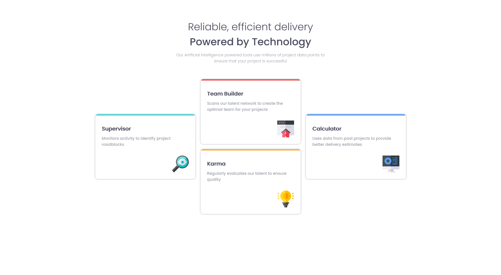

# Frontend Mentor - Four card feature section solution

This is a solution to the [Four card feature section challenge on Frontend Mentor](https://www.frontendmentor.io/challenges/four-card-feature-section-weK1eFYK). Frontend Mentor challenges help you improve your coding skills by building realistic projects. 

## Table of contents

- [Overview](#overview)
  - [The challenge](#the-challenge)
  - [Screenshot](#screenshot)
  - [Links](#links)
- [My process](#my-process)
  - [Built with](#built-with)
  - [Continued development](#continued-development)
  - [Useful resources](#useful-resources)
- [Author](#author)
- [Acknowledgments](#acknowledgments)

## Overview

### The challenge

Users should be able to:

- View the optimal layout for the site depending on their device's screen size

### Screenshot

### Links

- Live Site URL: [Github](https://justinjovert.github.io/Four-card-feature-section)

## My process
Built a container for the content with Flexbox properties. I grouped 'Team Builder' and 'Karma' into 1 item, and have the other two elements as individual items.

I set the properties of the item with Flexbox and a flex direction of column. When shrunk, I set it up to a row direction using media queries, also setting the container with flex-wrap using MQ so it wraps together rather than individually, maintaining its grouping even in smaller screens. 

When shrunk more, it automatically wraps the grouped elements into a single column, allowing for better display on smaller devices.

### Built with

- Semantic HTML5 markup
- CSS custom properties
- Flexbox

### Continued development

Continue to do challenges to solidify skills.

### Useful resources

- [Asaeneh's 30 Day of JavaScript](https://github.com/Asabeneh/30-Days-Of-JavaScript)

## Author

- [Github](https://github.com/Justinjovert/)
- Frontend Mentor - [Justinjovert](https://www.frontendmentor.io/profile/Justinjovert)

## Acknowledgments

Frontend Mentor and Asabeneh Yetayeh.